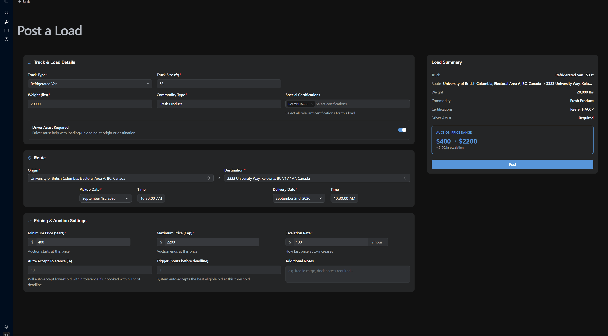
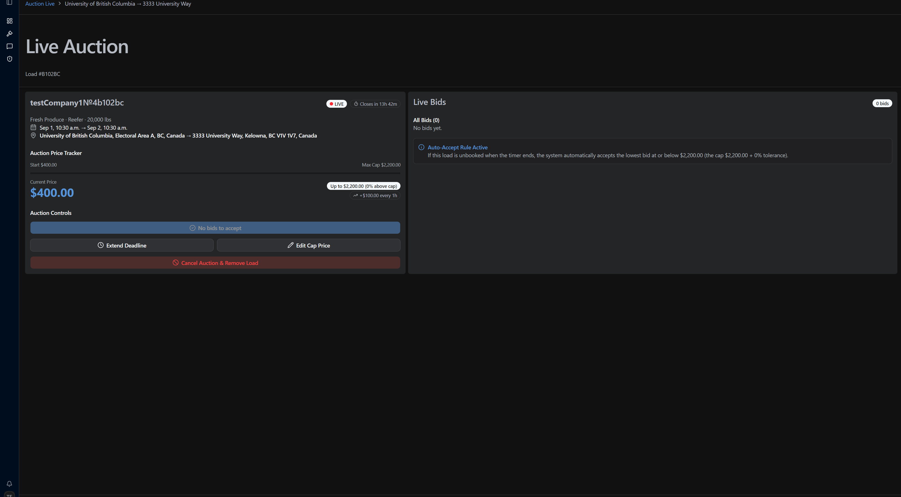
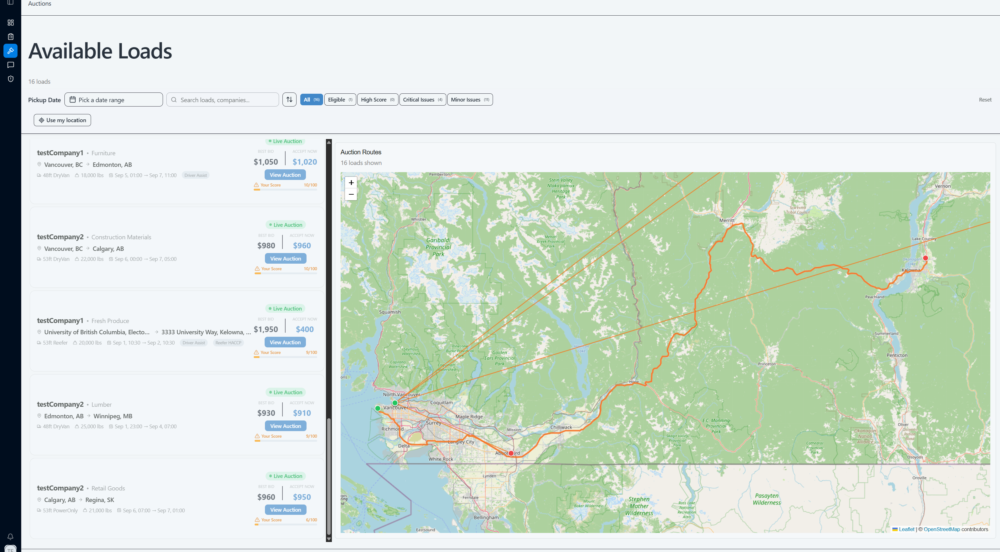
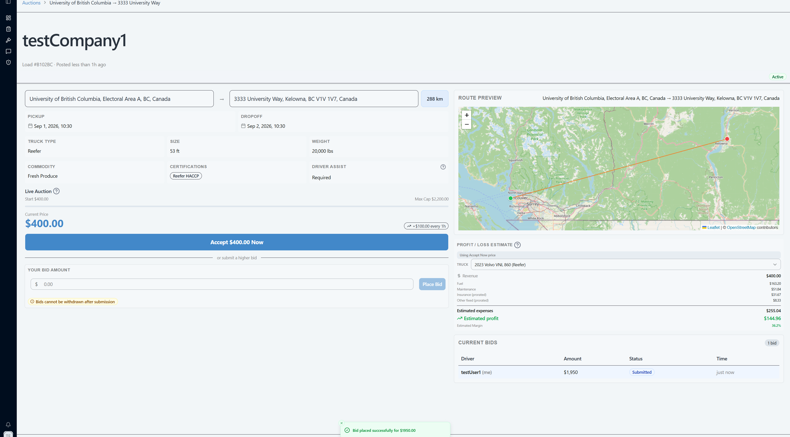
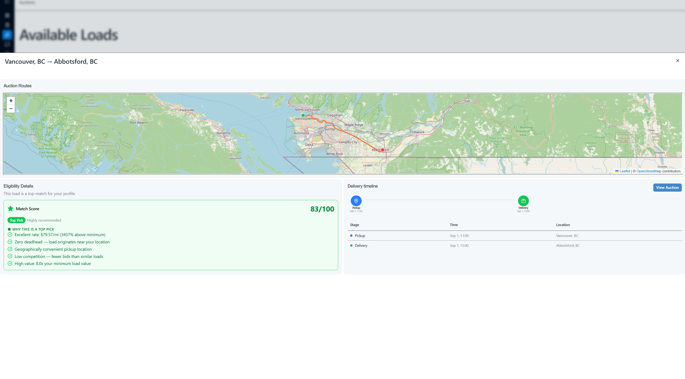
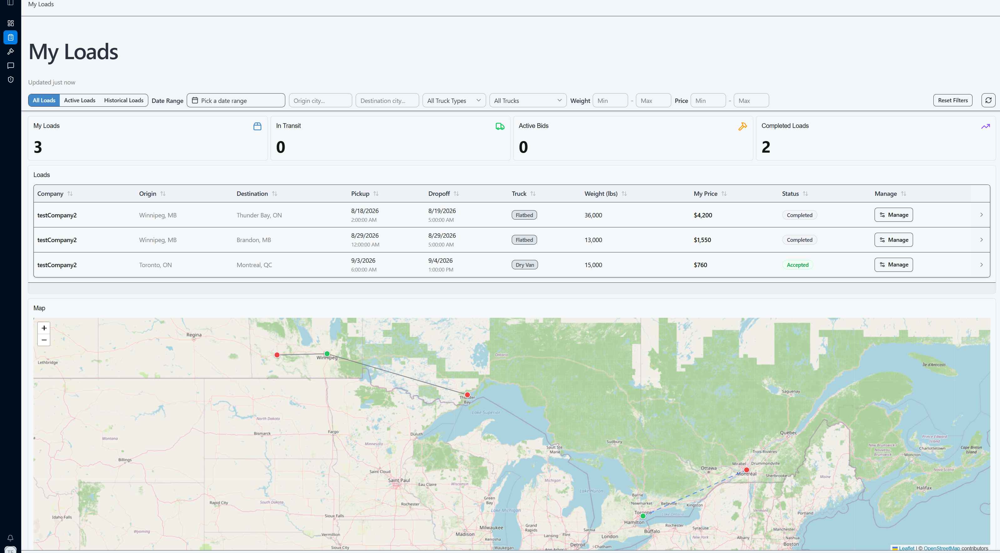
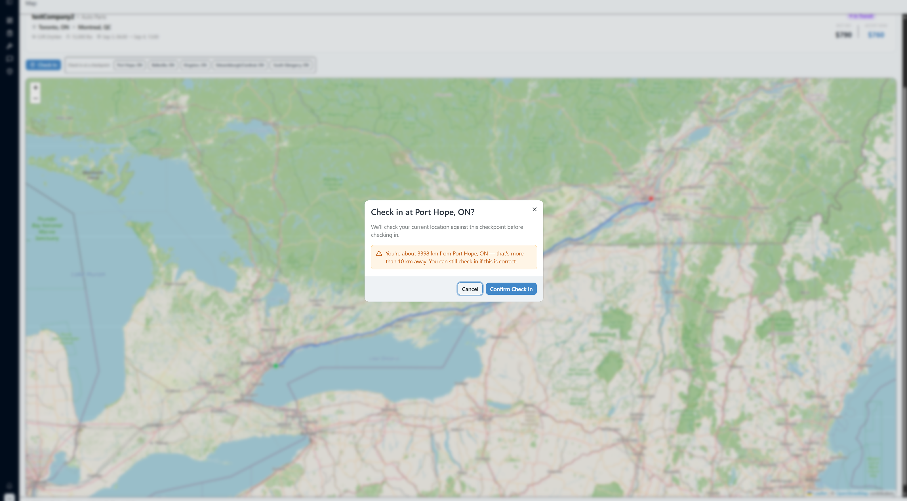
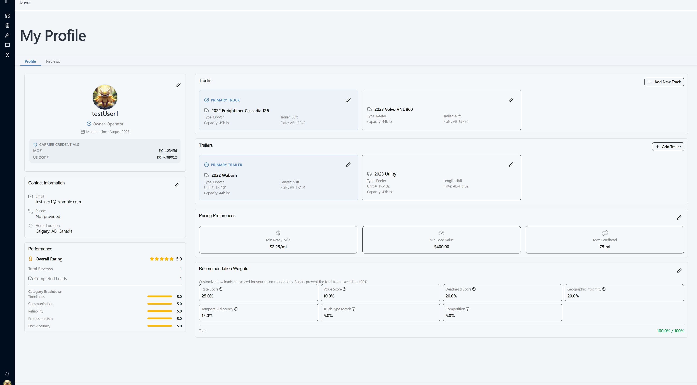
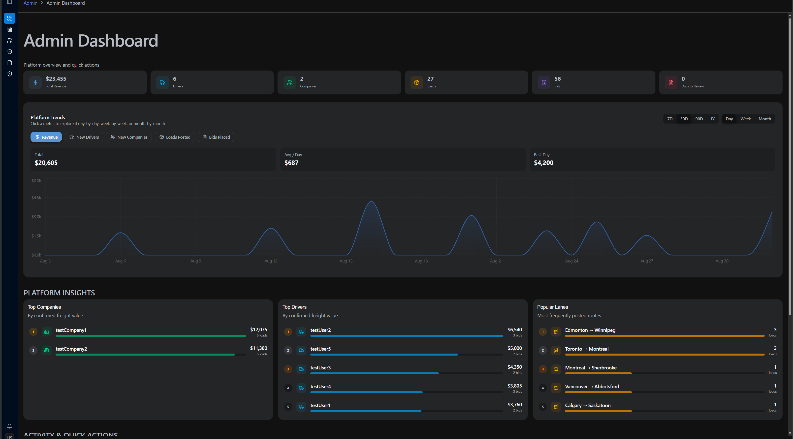

<h1>
  
  &nbsp; LoadLink
</h1>

> A real-time reverse-auction freight marketplace connecting Canadian shippers with truck drivers.

Companies post freight. Drivers compete for it in a live **time-decay reverse auction** — the price starts low and ticks upward on a configurable heartbeat until someone takes the load. Prices, bids, and auction state stream to every connected client over Server-Sent Events: no polling, no refresh buttons.

Built with React 19, Express 5, MongoDB, and Firebase.

---

## Contents

- [What is LoadLink?](#what-is-loadlink)
- [Who it's for](#who-its-for)
- [How it works](#how-it-works)
- [Features](#features)
- [Architecture](#architecture)
- [Tech stack](#tech-stack)
- [Getting started](#getting-started)
- [Demo accounts](#demo-accounts)
- [Testing](#testing)
- [Contributors](#contributors)

---

## What is LoadLink?

Traditional load boards list freight at a fixed rate, or hide the rate behind a phone call. LoadLink replaces that with an auction that runs itself.

A company posts a load with a **starting price**, a **price cap**, and an **escalation rate**. The auction goes live and a heartbeat engine raises the current price on a fixed interval. Drivers watching the load can either **claim it now** at the price on the screen, or **place a bid** below it — the lowest price they're willing to run it for. The auction closes one of three ways:

1. A driver claims the load at the current price.
2. The company accepts a bid manually from the live bid panel.
3. The deadline (or auto-accept trigger window) arrives and the best qualifying bid settles automatically.

Whichever path it takes, the close generates a PDF rate confirmation, stores it in S3, and notifies both sides. Waiting costs the company money and earns the driver money, so both sides have a reason to act — that tension is the whole product.

---

## Who it's for

**Shippers / companies** — businesses moving freight across Canada. Post a load, watch bids arrive live, accept one, extend the deadline, raise the cap, or cancel and reopen. Spend analytics break historical cost down over time and by route.

**Drivers / carriers** — owner-operators and small fleets looking for the next load. Every open auction is scored 0–100 against your truck, certifications, schedule, and rate preferences, so the feed leads with loads you can actually run. Revenue, expenses, and profit-by-lane are tracked as loads complete.

---

## How it works

### 1. A company posts a load

Origin, destination, commodity, weight, required truck type and certifications, pickup and dropoff windows, then the auction parameters: starting price, cap, escalation rate per hour, and an auto-accept tolerance. Addresses autocomplete through Geoapify, and the summary panel prices the auction range as you type.



### 2. The auction goes live

The heartbeat engine starts ticking `currentPrice` upward. The company gets a live control panel: current price, time remaining, every bid ranked best-first, and controls to accept, extend, edit the cap, or cancel.



### 3. Drivers bid or claim

The same auction from the driver's side: live price, creep rate, route preview, eligibility breakdown, and the two ways to take it.





### 4. The auction closes

Claim, manual accept, or auto-accept at the deadline. The load is assigned, a rate confirmation PDF is generated with `pdf-lib` and uploaded to S3 behind a presigned link, a message thread opens between the two parties, and the load moves into the delivery pipeline.

---

## Features

### Load recommendation & eligibility engine

Every open load is scored 0–100 against the driver's truck type and size, certifications, schedule availability, rate-per-mile preferences, and route value. Critical blockers (missing certification, wrong truck type) and minor flags (exceeds preferred deadhead) surface on the card itself, so a driver never opens a load they can't legally run. Recommended loads rank best-first, with every route on the page plotted on one map.



### Company spend analytics

Stats on active loads, live auctions, loads in transit, and bids today, plus spend-over-time and spend-by-route charts covering committed and completed freight spend.


### Driver revenue center

Total revenue, expenses, net profit, and margin, with profit broken down by route and by distance so a driver can tell which lanes are worth running. Expenses are logged per load from a global drawer.


### My loads

Assigned loads with a full filter bar (status, truck, date, price, origin, destination), a delivery timeline per load, route map, truck assignment, and Bill of Lading upload on delivery.



### Driver check-in

A privacy-conscious alternative to continuous GPS tracking. Instead of streaming a driver's position, LoadLink generates checkpoints along the route and the driver confirms each one as they pass it, giving the shipper progress without surveillance.



### Profile, fleet & preferences

Trucks and trailers with CRUD and a primary designation, certifications with expiry tracking and renewal alerts, carrier credentials (MC / US DOT), public contact details, notification preferences, and the rate preferences that feed the eligibility engine.



### Admin portal

Document verification, rate-confirmation and Bill of Lading review, user ban and delete, and a queue of submitted fraud and inaccurate-listing reports.



### Also in the box

- **In-app messaging** — per-load threads between the company and the assigned driver
- **Schedule conflict detection** — warns a driver when a bid or claim overlaps an existing assignment's pickup/dropoff window
- **Notifications** — in-app bell and toasts for bid accepted, rate confirmation ready, load status changes, and new messages
- **Blocklist & reporting** — block a company or driver from your feed (enforced server-side in every feed and recommendation query), or report fraud and inaccurate listings for admin review
- **Public profiles & reviews** — driver and company profiles with star ratings and written reviews
- **Document storage** — certifications, insurance, business documents, profile pictures, and generated PDFs, all on S3 behind presigned URLs
- **Guided walkthrough** — a role-aware product tour from the profile menu

---

## Architecture

```
/frontend   React 19 + Vite + TypeScript SPA
/backend    Node + Express 5 + TypeScript REST API
```

**Frontend.** Redux Toolkit with RTK Query. A single `api` instance (`frontend/src/services/api.ts`) owns the cache tags; each domain injects its own endpoints. Firebase handles credentials client-side; the app then resolves the MongoDB user and role from the backend. Routes and role gating are driven off one source of truth in `frontend/src/config/routes.ts`, which also builds the sidebar.

**Backend.** `index.ts` → routes → controller → service → Mongoose model. Errors are thrown as `ApiError(statusCode, message)` and rendered by one central error-handling middleware. `requireAuth` verifies Firebase ID tokens; `authorize` enforces roles.

**Heartbeat engine** (`backend/src/services/heartbeatService.ts`). A single interval started once Mongo connects. Each tick walks every live auction: expire it, creep the price, fire auto-accept when the trigger conditions are met. One failing auction is caught and logged rather than killing the tick.

**Real-time.** `backend/src/events/auctionEvents.ts` is an in-process `EventEmitter` used as pub/sub: mutation handlers emit bid and price updates, SSE stream handlers subscribe and forward them to connected clients. On the client, RTK Query opens an `EventSource` in `onCacheEntryAdded` and tears it down when the cache entry goes away. Note that the emitter is per-process — running the API clustered would require swapping it for Redis pub/sub or MongoDB change streams.

---

## Tech stack

| Layer | Tech |
| --- | --- |
| Frontend | React 19, TypeScript 6, Vite 8 |
| State | Redux Toolkit 2, RTK Query |
| Styling | Tailwind CSS 4, shadcn/ui (Radix), Geist, Lucide |
| Maps | Leaflet 1.9 / React Leaflet 5, OpenStreetMap, Geoapify |
| Charts | Recharts 3 |
| Backend | Node 22+, Express 5 |
| Database | MongoDB, Mongoose 9 |
| Auth | Firebase Authentication + Firebase Admin 14 |
| Storage | AWS S3 (presigned PUT/GET) |
| PDFs | pdf-lib |
| Real-time | Server-Sent Events |
| Testing | Vitest + React Testing Library (frontend), Jest 30 (backend) |

---

## Getting started

### Prerequisites

- Node.js 22+
- Docker Desktop (recommended) or a local MongoDB

### Environment

Two env files are needed: one at the project root (consumed by Docker Compose) and one at `./backend/.env`. Copy `.env.example` and fill in Firebase, AWS, and Geoapify credentials.

Firebase Admin credentials are optional in development — without them `requireAuth` logs a warning and skips token enforcement, so the API stays usable locally.

### Docker (recommended)

```bash
git clone https://github.com/Max-jzyan/LoadLink.git
cd LoadLink

# place your .env at the project root and at ./backend/.env

docker compose up --build
# app:     http://localhost:3000
# health:  http://localhost:5001/api/health
```

`docker compose down` stops everything; `docker compose down -v` also drops the database volume. The database seeds itself on first boot.

### Docker with hot reload

```bash
docker compose -f docker-compose.dev.yml up -d
# frontend: http://localhost:5173
# backend:  http://localhost:5001
# mongo:    localhost:27018
```

### Manual setup

```bash
# backend
cd backend
npm install
npm run dev          # http://localhost:5001
npm run seed         # seed users, loads, and auctions

# frontend (second terminal)
cd frontend
npm install
npm run dev          # http://localhost:5173
```

Vite proxies `/api/*` to `http://localhost:5001` in development, so there is no CORS setup to do.

---

## Demo accounts

Seeded by `npm run seed` (and automatically on first Docker boot). Password is `12345678` for all of them.

| Role | Email |
| --- | --- |
| Driver | testUser1@example.com |
| Driver | testUser2@example.com |
| Driver | testUser3@example.com |
| Driver | testUser4@example.com |
| Driver | testUser5@example.com |
| Company | testCompany1@example.com |
| Company | testCompany2@example.com |
| Admin | admin@example.com |

---

## Testing

```bash
cd backend && npm test     # Jest — controllers, services, middleware
cd frontend && npm test    # Vitest — API layer and components
```

- [End-to-end test plan](docs/TESTING.md) — a single manual pass across the whole product
- [XSS assessment](docs/security-xss.md) — every text input probed with script-injection payloads; no exploitable XSS found

---

## Contributors

Alexandar Lackovic · Wendy Tso · Max Yan · Kyle Jones · Eojin Lee
