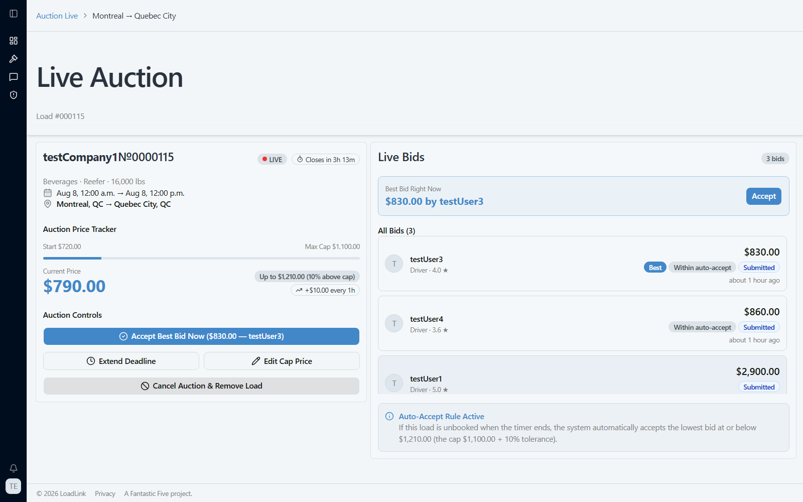
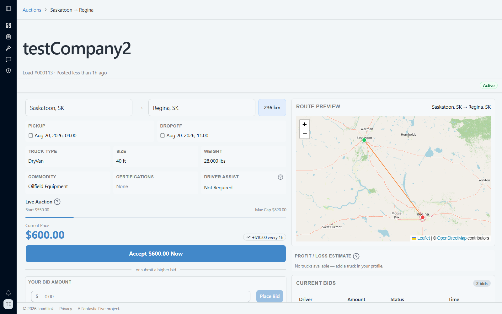
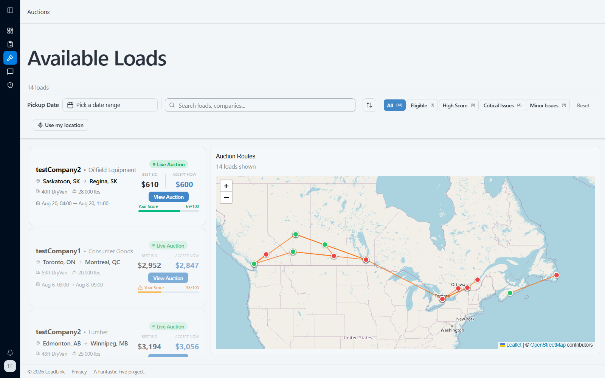
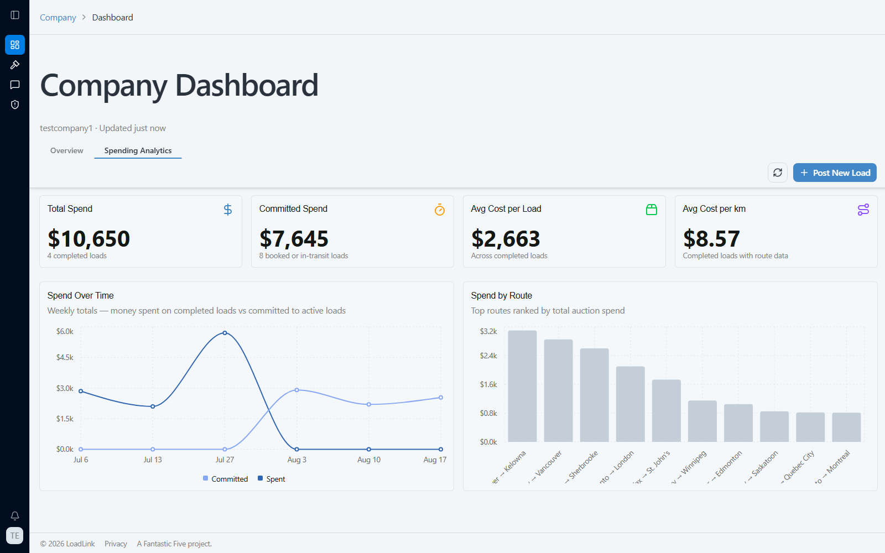
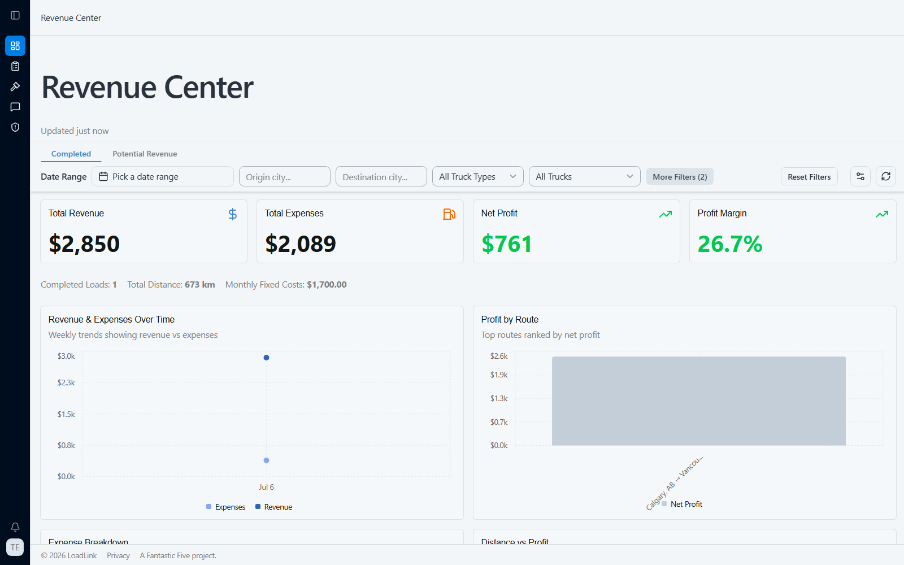

<h1>
  
  &nbsp; Load Link
</h1>

**By Team #5: The Fantastic Five**

## Meet the Team

Alexandar Lackovic (74213307) <br>
Wendy Tso (34159368) <br>
Max Yan (86293560) <br>
Kyle Jones (82804451) <br>
Eojin Lee (25508730)

## Project Description

Truck driving management system designed to streamline the logistics of cargo transport through auction-based marketplace. Our platform allows companies to post freight requirements that drivers can accept through a bidding system.

## Goals

### Original Goals (M0/M1)

LoadLink set out to be a truck driving management system that streamlines cargo transport logistics through an auction-based marketplace. Companies post freight, drivers compete for it through a reverse auction (price starts low and creeps up over time until a driver accepts or the deadline hits), inspired by Uber Courier's direct marketplace model, eBay's competitive bidding, and uShip's trust-building reviews.

The [M1 design document](docs/M1_Document.pdf) scoped three **non-trivial features** including a time-decay reverse auction system, a map/routing system, and a rating/preferences system. While **standard features** included role-based auth, load posting CRUD, search/filter/pagination, profile & fleet management, a bidding interface, a notification system, and separate dashboards for drivers and companies. The MVP was deliberately scoped to Canada-only travel, and the M1 peer-feedback session pushed us to scale back live GPS tracking of drivers in favor of a lighter-weight and privacy-conscious approach.

### How the Final Application Compares

**Met or exceeded every original goal.** All non-trivial and standard features from M1 shipped:

- The reverse auction system grew from a simple price-creep concept into a full heartbeat-driven pricing engine with SSE live updates, auto-accept, and company-side auction controls (extend deadline, edit cap, cancel/reopen).
- The rating/preferences idea became a full public profile + review system for both drivers and companies, plus a blocklist and fraud/inaccuracy reporting hub.
- The map system became real Leaflet/OpenStreetMap route visualization with delivery timelines and a GPS checkpoint-based Driver Check-In flow.

**Exceeded scope** with several features that were never in the original M1 plan: a custom multi-factor load recommendation & eligibility scoring engine for drivers, an admin portal (document verification, user bans, rate-confirmation and BOL review), in-app messaging between companies and drivers, schedule-conflict detection on bids, auto-generated PDF rate confirmations with AWS S3 storage, and AI-assisted route insights (fuel stops / rest areas) via OpenRouter.

**Deviated from plan** in two ways:

- **Live GPS driver tracking was dropped**, exactly as flagged in the M1 peer-feedback session, it was judged out of scope for the core product and a privacy risk. It was replaced by the Driver Check-In system: drivers confirm their position at generated route checkpoints instead of being tracked continuously.
- **AI Price Suggestion** (a custom ML model to recommend bid/asking prices) was scoped as a stretch goal but ultimately closed as we decided against automating price recommendations.

The Canada-only, single-currency scope from M1 was kept as planned.

## Key Features

Screenshots below are from the seeded demo data. Core, most non-trivial features first.

### 1. Time-Decay Reverse Auction System

The heart of LoadLink: a company posts a load at a starting price that automatically creeps upward every hour (or on whatever cadence the company sets) until a driver accepts it, places a winning bid, or the deadline passes and the best bid auto-accepts. Everything updates live over Server-Sent Events with no polling or refresh needed.

**Company view**: live bids ranked best-first, one-click accept, and controls to extend the deadline, raise the price cap, or cancel/reopen the auction:



**Driver view**: the same auction from the bidding side: current price, price-creep rate, route preview, and the option to accept the current price instantly or place a lower bid:



### 2. Load Recommendation & Eligibility Engine

Drivers see every open load and each one is scored 0–100 against the driver's truck, certifications, schedule, and rate preferences, with critical/minor eligibility flags surfaced directly on the card. Recommended loads are ranked best-first, and the routes for everything on the page are plotted on the map alongside the list.



### 3. Company Spend Analytics

Beyond the basic loads table, companies get a full analytics view of what they've spent and committed to spend, broken down over time and by route, so they can see cost trends at a glance.



### 4. Driver Revenue Center

Drivers get the same treatment on the earnings side: total revenue, expenses, net profit, and profit margin, with charts breaking profit down by route and by distance so a driver can tell which lanes are worth taking.



### Other notable features (no screenshot)

- **In-app messaging** between a company and the driver assigned to its load, once a load is booked
- **Driver Check-In** - GPS checkpoint confirmation along a route, the privacy-conscious replacement for live tracking
- **Schedule conflict detection** - warns a driver if a bid or claim overlaps an existing assignment
- **Admin portal** - document verification, rate-confirmation and Bill of Lading review, user bans, and report review
- **Blocklist & report system** - block a company/driver from your feed, or report fraud/inaccurate listings
- **Public driver & company profiles** with star ratings and written reviews
- **Auto-generated PDF rate confirmations**, uploaded to AWS S3 with a presigned download link

## Non-Trivial Features — Final Status

| Feature                                  | Status                                                 | Notes                                                                                                                   |
| ---------------------------------------- | ------------------------------------------------------ | ----------------------------------------------------------------------------------------------------------------------- |
| Time Decay Reverse Auction System        | **Completed**                                          | Heartbeat pricing engine, SSE live bid/price streaming, auto-accept, full company auction controls                      |
| Map / Route Visualization                | **Completed**                                          | Leaflet + OpenStreetMap route rendering, delivery timelines; pivoted from a live-tracking design (see below)            |
| Rating & Review System                   | **Completed**                                          | Public driver/company profiles with star ratings and written reviews                                                    |
| Load Recommendation & Eligibility Engine | **Completed** _(added scope, not in original M1 plan)_ | Multi-factor 0–100 scoring, critical/minor eligibility flags, detailed breakdown panel                                  |
| Blocklist & Report System                | **Completed** _(added scope)_                          | Block companies/drivers from feeds; report fraud or inaccurate listings, reviewed by admins                             |
| Admin Portal                             | **Completed** _(added scope)_                          | Document verification, user ban/delete, rate-confirmation and Bill of Lading review, report review                      |
| PDF Rate Confirmation + AWS S3 Storage   | **Completed** _(originally a stretch goal)_            | Auto-generated on auction close, uploaded to S3, presigned download URL                                                 |
| In-App Messaging                         | **Completed** _(added scope)_                          | Per-load message threads between the assigned driver and company                                                        |
| Schedule Conflict Detection              | **Completed** _(added scope)_                          | Warns a driver of overlapping assignments when bidding/claiming                                                         |
| Bill of Lading / Proof of Delivery       | **Completed**                                          | PDF generation plus driver upload and admin review flow finished in Milestone 5 (was in progress at M4)                 |
| AI-Assisted Route Insights               | **Completed** _(originally a stretch goal)_            | OpenRouter-powered fuel stop / rest area suggestions, with a static checkpoint fallback when the AI call is unavailable |
| Live Driver GPS Location Tracking        | **Dropped**                                            | Descoped in the M1 peer-feedback session over privacy/scope concerns; replaced by the Driver Check-In checkpoint flow   |
| AI Price Suggestion                      | **Dropped**                                            | Stretch goal to recommend bid/asking prices via a custom ML model; decided against automated price suggestions          |

## Milestone 1

[Milestone 1 PDF Document](docs/M1_Document.pdf)

## Milestone 2

### Milestone 2 Functionality

#### Non-Trivial Features

| Feature                                                                                                                      | M2 Status         | How to Use / Notes                                                                                                                                                                                   |
| ---------------------------------------------------------------------------------------------------------------------------- | ----------------- | ---------------------------------------------------------------------------------------------------------------------------------------------------------------------------------------------------- |
| **Time Decay Reverse Auction System** — price creep engine, SSE realtime bid/price streaming, auto accept, heartbeat service | Fully working     | **Company:** `/auctionLive/<loadId>` — **Driver:** `/driverAuctions/<loadId>`. Heartbeat ticks price up every hour and auto accept settles auction when time < threshold and a qualifying bid exists |
| **Auction Management Controls** — accept bid, cancel auction, extend deadline, edit cap price, reopen cancelled auction      | Fully working     | All controls are also visible on `/auctionLive/<loadId>` for the company that owns the load                                                                                                          |
| **Map System** — Leaflet route visualization between origin and destination                                                  | Partially working | Visible on Driver Auctions detail page and Driver Loads page. Live driver tracking was descoped in the M1 feedback session                                                                           |

#### Standard Features

| Feature                                                                                                                                                                           | M2 Status                   | How to Use / Notes                                                                                                   |
| --------------------------------------------------------------------------------------------------------------------------------------------------------------------------------- | --------------------------- | -------------------------------------------------------------------------------------------------------------------- |
| **Secure Authentication** — Firebase email/password and Google OAuth login, role selection (Company / Driver), protected routes, role-based sidebar                               | Fully working               | Go to `http://localhost:3000` -> Sign Up or Log In (each role sees only its own pages)                               |
| **Load Posting** — company creates a freight listing with origin, destination, commodity, weight, truck type, certifications, pickup/dropoff times; Geoapify address autocomplete | Fully working               | Log in as Company -> Loads -> Post Load (`/loads/post`)                                                              |
| **Company Loads Table** — paginated table of all company loads with status badges, bid counts, auction pricing                                                                    | Fully working               | Log in as Company -> Loads (`/loads`)                                                                                |
| **Company Dashboard** — stats cards (active loads, live auctions, loads in transit, bids today) + loads table                                                                     | Fully working               | Log in as Company -> Dashboard (`/company/dashboard`)                                                                |
| **Driver Auctions Browser** — browse all open loads, text search by origin/destination/commodity, recommended loads section                                                       | Fully working               | Log in as Driver -> Auctions (`/driverAuctions`)                                                                     |
| **Bidding Interface** — driver places a bid or claims load at current price; company sees bids in real time                                                                       | Fully working               | Driver: `/driverAuctions/<loadId>` -> Place Bid or Claim Now                                                         |
| **Driver Loads (My Loads)** — stats cards, assigned load table with status filter, delivery timeline, route map                                                                   | Partially working           | Log in as Driver -> My Loads (`/driverLoads`). Stats and table fully working and timeline shows pickup/dropoff steps |
| **Search, Filter & Pagination** — text search on driver load browser, status filter + pagination on driver loads table                                                            | Partially working           | Search bar on `/driverAuctions` and filter bar + pagination on `/driverLoads`                                        |
| **Profile & Fleet Management** — driver profile, truck CRUD (add, edit, delete truck)                                                                                             | Backend complete, no UI yet | API routes exist at `/api/driver/:id` and `/api/driver/:id/trucks`; profile page not yet built                       |
| **Notification System**                                                                                                                                                           | Not started for M2          | Planned for M3                                                                                                       |

#### Stretch Features

| Feature                                                                                             | M2 Status          | Notes                                                                                                                                                                        |
| --------------------------------------------------------------------------------------------------- | ------------------ | ---------------------------------------------------------------------------------------------------------------------------------------------------------------------------- |
| **PDF Rate Confirmation** — auto-generate contract PDF on auction close using pdf-lib, upload to S3 | Not implemented    | `pdf-lib` is a dependency and the constant `RATE_CONFIRMATION_URL_BASE` is defined, but no generation or upload code exists yet; accept-bid returns a placeholder URL string |
| **AWS S3 Document Storage** — driver licence/insurance uploads, rate confirmation PDFs              | Not implemented    | AWS keys are in `.env` but no upload code exists in the backend at M2                                                                                                        |
| **Blocklist & Preferences** — block companies/drivers from appearing in feeds                       | Not implemented    | `Blocklist` Mongoose model created; no endpoints or UI at M2                                                                                                                 |
| **Live Driver Location Tracking**                                                                   | Removed from scope | Descoped in M1 peer-feedback session; replaced with static route visualization                                                                                               |
| **AI Route Suggestions** (fuel stops, rest areas)                                                   | Not started        | Planned to potentially be added after M2                                                                                                                                     |

### Standard Features — M1 Cross-Reference

Here are some features in our M1 design doc's standard features and their M2 state.

| M1 Standard Feature                                                    | M2 Implementation                                                                                                                                         |
| ---------------------------------------------------------------------- | --------------------------------------------------------------------------------------------------------------------------------------------------------- |
| Secure user authentication for different roles (companies and drivers) | Firebase Auth with email/password and Google OAuth. Role selected at signup. Role-specific protected routes and sidebar navigation enforced               |
| Load posting (CRUD for freight)                                        | Full create via `/loads/post`. Read via `/loads` table and `/loads/:loadId` detail. Update via `PATCH /api/loads/:loadId`. Delete via cancel auction flow |
| Search, filter, and pagination of loads                                | Text search (origin/destination/commodity) on Driver Auctions page. Status filter + paginator on Driver Loads table                                       |
| Bidding interface                                                      | Driver can place a bid (below current price) or claim load at current price. Company sees all bids ranked best-first via SSE                              |
| Dashboard specific to drivers                                          | Stats cards (loads, in-transit, active bids, completed) + load table + Leaflet map on `/driverLoads`                                                      |
| Revenue dashboard for companies                                        | Stats cards (active loads, live auctions, in-transit, bids today) + loads table on `/company/dashboard`                                                   |

### Test Plan

[Milestone 2 Test Plan](docs/TestPlan%20M2.md)

### Things We Still Need To Implement

- We don't have automated test suites exist yet (`npm test` runs 0 suites in both frontend and backend - TA said just having a test plan is sufficient for M2)
- `PLACEHOLDER_DRIVER_ID` in `DriverAuctions.tsx` affects only the recommended loads and active bids banner on the browse page — bid placement and claim both use the real logged-in driver ID
- Profile/Fleet management UI not yet built (backend API complete)
- Notification system not started
- PDF rate confirmation and S3 document storage not yet implemented (placeholder URL returned on bid accept)

## Milestone 3

### Milestone 3 Functionality

> All features below are on the `Milestone3` branch (`origin/Milestone3`, HEAD `228d574`).
> The `feat/ai-insights` feature branch (OpenRouter AI route suggestions) is **not yet merged** into Milestone3 — see AI Route Suggestions in Stretch Features below.

#### Non-Trivial Features

| Feature                                                                                                                                                                 | M3 Status                    | How to Use / Notes                                                                                                                                                                                                                                                                                                                                                                    |
| ----------------------------------------------------------------------------------------------------------------------------------------------------------------------- | ---------------------------- | ------------------------------------------------------------------------------------------------------------------------------------------------------------------------------------------------------------------------------------------------------------------------------------------------------------------------------------------------------------------------------------- |
| **Time Decay Reverse Auction System** — price creep engine, SSE real-time bid/price streaming, auto-accept, heartbeat service                                           | Fully working             | **Company:** `/auctionLive/<loadId>` — **Driver:** `/driverAuctions/<loadId>`. `heartbeatService` ticks `currentPrice` up every `HEARTBEAT_INTERVAL_MS` and auto-accepts when within `autoAcceptTriggerHours` of deadline or when price meets the lowest submitted bid / cap                                                                                                          |
| **Auction Management Controls** — accept bid, cancel, extend deadline, edit cap price, reopen cancelled auction                                                         | Fully working             | `AuctionControls`, `CancelAuctionDialog`, `ReopenAuctionDialog`, `EditCapPriceDialog`, `ExtendDeadlineDialog` all on `/auctionLive/<loadId>` for the owning company                                                                                                                                                                                                                   |
| **Custom Algorithm Load Recommendation & Eligibility Engine** — multi-factor scoring (0–100), critical/minor eligibility flags, high-score highlights, detailed breakdown panel | Fully working (NEW in M3) | Log in as Driver → Auctions (`/driverAuctions`). Each load card shows an `EligibilityBadge` with score. Click a card to see the full `DetailedEligibilityPanel`. Scoring factors: schedule fit, certification match, truck-type match, rate-per-mile vs driver prefs, route value. Recommendations ranked best-first. Backend: `driverService.getScoredLoads` + `getRecommendedLoads` |

#### Standard Features

| Feature                                                                                                                                                                                                                                 | M3 Status                              | How to Use / Notes                                                                                                                                                                                                 |
| --------------------------------------------------------------------------------------------------------------------------------------------------------------------------------------------------------------------------------------- | -------------------------------------- | ------------------------------------------------------------------------------------------------------------------------------------------------------------------------------------------------------------------ |
| **Secure Authentication** — Firebase email/password + Google OAuth, role selection (Company / Driver / Admin), protected routes, role-based sidebar                                                                                     | Fully working                       | `http://localhost:3000` → Sign Up / Log In. `RoleRoute` auth guard + `requireAuth` / `authorize` middleware enforces role-based access. Firebase persistence upgraded to full-browser (local) persistence          |
| **Load Posting (CRUD)** — create, read, update freight listings; Geoapify address autocomplete                                                                                                                                          | Fully working                       | Log in as Company → Loads → Post Load (`/loads/post`). View detail at `/loads/:loadId`. Edit at `/loads/:loadId/edit`                                                                                              |
| **Company Loads Table** — paginated table with status badges, bid counts, auction pricing                                                                                                                                               | Fully working                       | Log in as Company → Loads (`/loads`)                                                                                                                                                                               |
| **Company Dashboard + Spending Analytics** — stats cards (active loads, live auctions, in-transit, bids today), loads table, spend-over-time chart, spend-by-route chart, spend summary cards                                           | Fully working (analytics NEW in M3) | Log in as Company → Dashboard (`/company/dashboard`). `SpendTimeChart`, `SpendByRouteChart`, `CompanySpendCards` show historical freight spend                                                                     |
| **Company Auctions Overview** — searchable list of all company auctions across all statuses with live/closed/cancelled badges and direct links to auction detail                                                                        | Fully working (NEW in M3)           | Log in as Company → Auctions (`/company/auctions`)                                                                                                                                                                 |
| **Driver Auctions Browser** — browse all open loads, text search, recommended loads section with scores, eligibility badges                                                                                                             | Fully working                       | Log in as Driver → Auctions (`/driverAuctions`). Recommendations engine + `EligibilityBadge` score per card                                                                                                        |
| **Bidding Interface** — driver places a bid or claims load at current price; company sees bids in real time via SSE                                                                                                                     | Fully working                       | Driver: `/driverAuctions/<loadId>` → Place Bid (`PlaceBidDialog`) or Claim Now (`ClaimLoadDialog`). SSE streams bids/price to company live                                                                         |
| **Driver Revenue Center (My Loads)** — stats cards, assigned load table with full filter bar (status / truck / date / price / origin / destination), delivery timeline, route map, truck assignment, revenue/expense charts             | Fully working (enhanced in M3)      | Log in as Driver → My Loads (`/driverLoads`). `DeliveryTimeline`, `DriverMap` (Leaflet), `RevenueTimeChart`, `DistanceProfitScatterChart`, `ExpenseBreakdownChart`, `ProfitByRouteChart` all on this page          |
| **Driver Revenue Center Dashboard** — revenue stats, animated numbers, expense tracking, global expense drawer                                                                                                                          | Fully working (NEW in M3)           | Log in as Driver → Revenue Center (`/dashboard`). Shows `RevenueStatsRow`, `RevenueSummaryCards`, charts, and `GlobalExpenseDrawer`                                                                                |
| **Profile & Fleet Management** — driver profile, truck CRUD (add/edit/delete, set primary), trailer CRUD (add/edit/delete, set primary), certifications, carrier credentials (MC/DOT), notification preferences, profile picture upload | Fully working (UI NEW in M3)        | Log in as Driver → Profile (`/driver`). `TruckDrawer`, `TrailerDrawer`, `DriverInfoDrawer`, `NotificationPreferencesCard`. Backend API at `/api/driver/:id` and `/api/driver/:id/trucks` + `/api/trailers` |
| **Notification System** — in-app notification bell, toast notifications, bid-accepted / rate-confirmation-ready / load-status events                                                                                                    | Fully working (NEW in M3)           | `NotificationBell` in the top navigation. `ToastManager` fires on key events. Backend: `notificationService` fires events on bid-accept and auction close                                                          |
| **Blocklist & Preferences** — block companies/drivers from appearing in feeds, server-side enforcement                                                                                                                                  | Fully working (NEW in M3)           | Log in as Driver or Company → Settings → Blocklist (`/blocklist`). `blocklistService` enforces blocking in all feed and recommendation queries                                                                     |
| **Driver Public Profile + Reviews/Ratings** — public-facing driver profile with star ratings, review submission                                                                                                                         | Fully working (NEW in M3)           | Navigate to `/driver/:driverId` (linked via `DriverNameLink` components throughout app). Submit a review via `ReviewForm`                                                                                  |
| **Report System** — report fraud, report inaccurate listings, report hub                                                                                                                                                                | Fully working (NEW in M3)           | `/report` → `ReportHub`. Report fraud at `/report/fraud`, inaccurate listing at `/report/inaccurate`. Backend: `reportController` + `reportService`                                                                |
| **Map System** — Leaflet route visualization between origin and destination                                                                                                                                                             | Fully working                       | Visible on Driver Loads (`/driverLoads`) and Driver Auction detail (`/driverAuctions/:loadId`). Also available at standalone `/map`. Static route visualization (Leaflet + Geoapify tiles)                         |
| **Search, Filter & Pagination** — text search on load browser, comprehensive filter bar on driver loads                                                                                                                                 | Fully working                       | Search bar + eligibility filter on `/driverAuctions`; `DriverLoadFilterBar` (status, truck, date, price, origin, destination) + paginated `DataTable` on `/driverLoads`                                            |
| **Role-Based Auth Guard** — `RoleRoute` component prevents unauthorized access, Firebase token enforced on every API call                                                                                                               | Fully working (NEW in M3)           | Attempting to access a restricted route redirects to the appropriate role home. Backend `requireAuth` + `authorize` middleware validates Firebase JWT on all protected endpoints                                   |

#### Stretch Features

| Feature                                                                                                                     | M3 Status                     | Notes                                                                                                                                                                                                                                                                      |
| --------------------------------------------------------------------------------------------------------------------------- | ----------------------------- | -------------------------------------------------------------------------------------------------------------------------------------------------------------------------------------------------------------------------------------------------------------------------- |
| **PDF Rate Confirmation** — auto-generate contract PDF on auction close using pdf-lib, upload to S3, presigned download URL | Fully working (NEW in M3)  | `pdfService.generateRateConfirmationPdf` (pdf-lib) runs on bid accept and claim in `auctionService`; uploads to S3 and stores presigned URL on the `Bid` model (`rateConfirmationUrl` / `rateConfirmationKey`). Company and admin can manually regenerate via admin portal |
| **AWS S3 Document Storage** — certification/insurance uploads, business docs, profile pictures, rate-confirmation PDFs      | Fully working (NEW in M3)  | `uploadService` + `s3Client` + `uploadController` issue presigned PUT URLs. Used for certification/business docs (`/api/upload`), profile pictures (`AvatarUploadField`), and rate-confirmation PDFs                                                                       |
| **Admin Portal** — document verification/review, rate-confirmation listing, user management                                 | Fully working (NEW in M3)  | Log in as Admin → Dashboard (`/admin/dashboard`), Documents (`/admin/documents`), Users (`/admin/users`), Rate Confirmations (`/admin/rate-confirmations`). Seeded admin credentials in Canvas `.env` file                                                                 |
| **AI Route Suggestions** — OpenRouter-powered route analysis with fuel stop, rest area, and route insights                  | Not merged into Milestone3 | Implemented on local `feat/ai-insights` branch (`8881d62`) — `aiInsightsService`, `openrouterService`, `AiInsightsPanel`. Needs to be merged before final submission                                                                                                       |
| **Live Driver Location Tracking**                                                                                           | Removed from scope            | Descoped in M1 peer-feedback session; replaced with static route visualization                                                                                                                                                                                             |

---

### Standard Features — M1 Cross-Reference

| M1 Standard Feature                                                    | M3 Implementation                                                                                                                                                                                   |
| ---------------------------------------------------------------------- | --------------------------------------------------------------------------------------------------------------------------------------------------------------------------------------------------- |
| Secure user authentication for different roles (companies and drivers) | Firebase Auth (email/password + Google OAuth), role selected at signup, `RoleRoute` auth guard + `requireAuth`/`authorize` middleware, role-specific sidebar enforced. Admin role added in M3       |
| Load posting (CRUD for freight)                                        | Create via `/loads/post`; read via `/loads` table and `/loads/:loadId` detail; update via `PATCH /api/loads/:loadId` (`LoadEdit`); delete/cancel via cancel-auction flow                            |
| Search, filter, and pagination of loads                                | Text search (origin/destination/commodity) + eligibility filter on Driver Auctions; full `DriverLoadFilterBar` (status/truck/date/price/origin/destination) + paginated `DataTable` on Driver Loads |
| Bidding interface                                                      | Driver places a bid (below current price) or claims at current price (`PlaceBidDialog`/`ClaimLoadDialog`); company sees all bids ranked best-first via SSE (`AuctionLive`)                          |
| Dashboard specific to drivers                                          | Revenue Center (`/dashboard`) with stats, charts, expense tracking + My Loads (`/driverLoads`) with full filter bar, load table, Leaflet `DriverMap`, and `DeliveryTimeline`                        |
| Revenue dashboard for companies                                        | Stats cards + loads table + spend analytics charts on `/company/dashboard`                                                                                                                          |

---

### Test Plan

[Milestone 3 Test Plan](docs/TestPlan%20M3.md)

### Bug Tracking

Known bugs are tracked on [GitHub Issues](https://github.students.cs.ubc.ca/CPSC455-2026S/team05/issues)

### Backend Test Suite

`cd backend && npm test` runs **22 Jest test files** covering:

- **Controllers:** auction, blocklist, company, driver, load, report, review, truck, upload, user
- **Services:** auction, blocklist, driver, heartbeat, load, report, review, truck, upload
- **Middleware:** authorize, errorHandler, requireAuth

Frontend automated tests are not yet implemented.

---

## Milestone 4

### Milestone 4 Functionality

#### Non-Trivial Features

| Feature                                                                                                                                 | M4 Status                 | How to Use / Notes                                                                                                                                                                                                                              |
| ---------------------------------------------------------------------------------------------------------------------------------------- | -------------------------- | -------------------------------------------------------------------------------------------------------------------------------------------------------------------------------------------------------------------------------------------- |
| **Time Decay Reverse Auction System** — price creep engine, SSE real-time bid/price streaming, auto-accept, heartbeat service             | Fully working             | **Company:** `/auctionLive/<loadId>` — **Driver:** `/driverAuctions/<loadId>`. `heartbeatService` ticks `currentPrice` up every `HEARTBEAT_INTERVAL_MS` and auto-accepts when within `autoAcceptTriggerHours` of deadline or when price meets the lowest submitted bid / cap |
| **Auction Management Controls** — accept bid, cancel, extend deadline, edit cap price, reopen cancelled auction                          | Fully working             | `AuctionControls`, `CancelAuctionDialog`, `ReopenAuctionDialog`, `EditCapPriceDialog`, `ExtendDeadlineDialog` all on `/auctionLive/<loadId>` for the owning company                                                                            |
| **Custom Algorithm Load Recommendation & Eligibility Engine** — multi-factor scoring (0–100), critical/minor eligibility flags, high-score highlights, detailed breakdown panel | Fully working             | Log in as Driver → Auctions (`/driverAuctions`). Each load card shows an `EligibilityBadge` with score. Click a card for the full `DetailedEligibilityPanel`. Backend: `driverService.getScoredLoads` + `getRecommendedLoads`                |

#### Standard Features

| Feature                                                                                                                                                                                                                                 | M4 Status                 | How to Use / Notes                                                                                                                                                                                                 |
| --------------------------------------------------------------------------------------------------------------------------------------------------------------------------------------------------------------------------------------- | -------------------------- | -------------------------------------------------------------------------------------------------------------------------------------------------------------------------------------------------------------- |
| **Company Public Profile** — public-facing company page, mirrors the existing driver public profile                                                                                                                                     | Fully working (NEW in M4) | Navigate to `/company/:companyId` (linked wherever a company name appears)                                                                                                                                       |
| **Admin User Actions** — ban and delete user accounts from the admin panel                                                                                                                                                              | Fully working (NEW in M4) | Log in as Admin → Users (`/admin/users`) → `BanUserDialog` / `DeleteUserDialog`                                                                                                                                   |
| **Document Expiry / Renewal Alerts** — warns a driver when a certification document has expired or expires within 30 days                                                                                                              | Fully working (NEW in M4) | Log in as Driver → Profile (`/driver`) or Revenue Center (`/dashboard`). `useDriverExpiryBanner` shows an `AlertBanner` prompting the driver to update the document; also surfaced via `NotificationBell`        |
| **Bill of Lading / Proof of Delivery** — PDF generated and downloadable by driver + company users                                                                                                                                             | In progress | PDF is generated but no frontend for uploading completed PDF for company or admin review                                                               |
| **Secure Authentication** — Firebase email/password + Google OAuth, role selection (Company / Driver / Admin), protected routes, role-based sidebar                                                                                     | Fully working             | `http://localhost:3000` → Sign Up / Log In. `RoleRoute` auth guard + `requireAuth` / `authorize` middleware enforces role-based access                                                                           |
| **Load Posting (CRUD)** — create, read, update freight listings; Geoapify address autocomplete                                                                                                                                          | Fully working             | Log in as Company → Auctions → Post Load (`/loads/post`). View detail at `/loads/:loadId`. Edit at `/loads/:loadId/edit`. Can save addresses as favourites now.    |
| **Company Auctions Overview** — searchable list of all company loads/auctions across all statuses with status badges, bid counts, live/closed/cancelled badges; single entry point for company load management (standalone `/loads` table removed) | Fully working             | Log in as Company → Auctions (`/company/auctions`)                                                                                                                                                                |
| **Company Dashboard + Spending Analytics** — stats cards (active loads, live auctions, in-transit, bids today), loads table, spend-over-time chart, spend-by-route chart, spend summary cards                                          | Fully working             | Log in as Company → Dashboard (`/company/dashboard`)                                                                                                                                                              |
| **Driver Auctions Browser** — browse all open loads, text search, recommended loads section with scores, eligibility badges                                                                                                            | Fully working             | Log in as Driver → Auctions (`/driverAuctions`). Enable location access to sort loads by distance from your current position                                                                                    |
| **Bidding Interface** — driver places a bid or claims load at current price; company sees bids in real time via SSE                                                                                                                     | Fully working             | Driver: `/driverAuctions/<loadId>` → Place Bid (`PlaceBidDialog`) or Claim Now (`ClaimLoadDialog`). SSE streams bids/price to company live                                                                       |
| **Driver Revenue Center (My Loads)** — stats cards, assigned load table with full filter bar (status / truck / date / price / origin / destination), delivery timeline, route map, truck assignment, revenue/expense charts             | Fully working             | Log in as Driver → My Loads (`/driverLoads`)                                                                                                                                                                      |
| **Driver Revenue Center Dashboard** — revenue stats, animated numbers, expense tracking, global expense drawer                                                                                                                          | Fully working             | Log in as Driver → Revenue Center (`/dashboard`)                                                                                                                                                                  |
| **Profile & Fleet Management** — driver profile, truck CRUD (add/edit/delete, set primary), trailer CRUD (add/edit/delete, set primary), certifications, carrier credentials (MC/DOT), profile picture upload                          | Fully working             | Log in as Driver → Profile (`/driver`)                                                                                                                                                                            |
| **Notification System** — in-app notification bell, toast notifications, bid-accepted / rate-confirmation-ready / load-status / message events                                                                                         | Fully working             | `NotificationBell` in the top navigation. `ToastManager` fires on key events                                                                                                                                      |
| **Driver Public Profile + Reviews/Ratings** — public-facing driver profile with star ratings, review submission                                                                                                                         | Fully working             | Navigate to `/driver/:driverId` (linked via `DriverNameLink` components throughout app). Submit a review via `ReviewForm`                                                                                        |
| **Report System** — report fraud, report inaccurate listings, report hub                                                                                                                                                                | Fully working             | `/report` → `ReportHub`. Report fraud at `/report/fraud`, inaccurate listing at `/report/inaccurate`. Admins can now review all submitted reports, with links to the reporter/target profiles, at `/admin/reports` |
| **Map System** — Leaflet route visualization between origin and destination                                                                                                                                                             | Fully working             | Visible on Driver Loads (`/driverLoads`) and Driver Auction detail (`/driverAuctions/:loadId`). Also reachable via `/map?loadId=<id>` from an in-transit load, which now also drives the Driver Check-In flow (see Stretch Features) |
| **Search, Filter & Pagination** — text search on load browser, comprehensive filter bar on driver loads                                                                                                                                 | Fully working             | Search bar + eligibility filter on `/driverAuctions`; `DriverLoadFilterBar` (status, truck, date, price, origin, destination) + paginated `DataTable` on `/driverLoads`                                          |
| **Role-Based Auth Guard** — `RoleRoute` component prevents unauthorized access, Firebase token enforced on every API call                                                                                                               | Fully working             | Attempting to access a restricted route redirects to the appropriate role home. Backend `requireAuth` + `authorize` middleware validates Firebase JWT on all protected endpoints                                 |

#### Stretch Features

| Feature                                                                                                                                        | M4 Status                 | Notes                                                                                                                                                                                                                              |
| ------------------------------------------------------------------------------------------------------------------------------------------------- | --------------------------- | ---------------------------------------------------------------------------------------------------------------------------------------------------------------------------------------------------------------------------- |
| **Schedule Conflict Detection** — warns a driver when placing a bid or claiming a load that overlaps an existing assignment's timeline            | Fully working (NEW in M4) | Shown automatically in `PlaceBidDialog` / `ClaimLoadDialog` (`ScheduleConflictWarning`) when the selected load's pickup/dropoff window conflicts with another accepted load                                                      |
| **In-App Messaging** — per-load message threads between company and driver                                                                        | Fully working (NEW in M4) | Log in as either role → Messages (`/messages`) for the thread list, or the message icon on a load (`MessageButton` → `LoadMessagesDrawer`) for a specific thread. Backend: `messageController` + `messageService`.               |
| **Driver Check-In** — GPS-based checkpoint check-in along a load's route; repurposes the standalone route-viewer map page into an in-transit check-in flow | Fully working (NEW in M4) | Log in as Driver → open an in-transit load's map (`/map?loadId=<id>`). `CheckpointCheckIn` walks generated route checkpoints (`lib/checkpoints.ts`); `CheckInDialog`/`CheckpointConfirmDialog` confirm each stop |
| **Role-based walkthrough tour** — walkthrough of each tab functionality for driver and company user| Fully working (NEW in M4) | Click the profile menu and select ' Walkthrough'. |
| **Blocklist & Preferences** — block companies/drivers from appearing in feeds, server-side enforcement                                             | Fully working             | Log in as Driver or Company → Settings → Blocklist (`/blocklist`). Now enhanced with backend role / userID based guard.                                                                                        |
| **Admin Portal** — document verification, rate-confirmation listing, bill of lading review, user management, reports                               | Fully working             | Log in as Admin → Dashboard (`/admin/dashboard`), Documents (`/admin/documents`), Users (`/admin/users`), Rate Confir mations (`/admin/rate-confirmations`), Bill of Lading (`/admin/bill-of-lading`), Reports (`/admin/reports`) |
| **PDF Rate Confirmation** — auto-generate contract PDF on auction close using pdf-lib, upload to S3, presigned download URL                        | Fully working             | `pdfService.generateRateConfirmationPdf` runs on bid accept and claim; uploads to S3 and stores presigned URL on the `Bid` model. Now correctly populates MC #, US DOT #, driver phone, truck unit #, and trailer length. Company and admin can manually regenerate via admin portal |
| **AWS S3 Document Storage** — certification/insurance uploads, business docs, profile pictures, bill-of-lading images, rate-confirmation PDFs      | Fully working             | `uploadService` + `s3Client` + `uploadController` issue presigned PUT URLs                                                                                                                                                        |
| **AI Price Suggestion** — custom ML model analyzing historical load data to recommend prices for drivers and companies                             | Removed from scope        | Closed as `wontfix` — decided against automated price suggestions                                                                                                                              |
| **Live Driver Location Tracking** — custom SSE real-time location streaming (Mapbox/Leaflet + OSM), route progress tracking for shippers           | Removed from scope        | Descoped in the M1 peer-feedback session in favor of the Driver Check-In flow above                                                                                                                                              |

### Test Plan

[Milestone 4 Test Plan](docs/TestPlan%20M4.md)

---

## Milestone 5

Milestone 5 was a stabilization and polish pass rather than a new-feature milestone, no non-trivial or standard features were added or removed. Highlights:

- **Bill of Lading upload finished** — the driver-facing BOL upload button (in progress at M4) was completed and fixed, closing out the Bill of Lading / Proof of Delivery workflow end to end.
- **SSE connection leak fixed** — the auction price/bid event stream is now properly killed when a subscribing component unmounts, instead of continuing to run in the background.
- **Dialog state bugs fixed** — dialogs across the app now reliably reset their internal state on close (`d3a4ea9`), and a debounce change on the auctions filter bar that had broken dialog behavior was reverted/fixed (`85898fa`, `22b0679`).
- **Responsive fix** — long company names no longer break layout on auction/load cards.
- **Docker cleanup** — added `.dockerignore` files for both frontend and backend to keep build contexts and images smaller.
- **Backend test suite grew** from 22 to 26 Jest test files (message controller/service, additional coverage across existing suites).
- A Docker-based CI test step was attempted (`c9a09df`) but reverted (`3909220`) after it proved unreliable; CI continues to run tests outside Docker.

No features were dropped in Milestone 5.

### Test Plan

Milestone 5 reused the [Milestone 4 Test Plan](docs/TestPlan%20M4.md) — its scope covers the current feature set with no functional changes in M5.

---

### Security Testing — XSS

We tested every text input in the app for cross-site scripting (script injection via form fields, search boxes, and stored profile/review data). Payloads such as `<script>`, `` were injected and the render pages inspected for execution.

**Result: no exploitable XSS was found**. React's automatic output escaping renders all user-supplied strings as inert text. 

Full write-up, input-point inventory, tests, results, and mitigations:

[Milestone 4 — XSS Assessment](docs/M4-XSS.md)

---

### Tech Stack

| Layer          | Tech                                   | Version   |
| -------------- | -------------------------------------- | --------- |
| Frontend       | React                                  | 19        |
| Build Tool     | Vite                                   | 8         |
| Language       | Typescript                             | 6         |
| Style          | TailwindCSS                            | 4         |
| Components     | shadcn (radix, nova, lucide and geist) | 4         |
| Maps           | Leaflet/React Leaflet                  | 1/5       |
| Testing        | Vitest and RTL                         | 4.1/16.3  |
| Formatting     | Prettier and ESLint                    | 10.3/10.1 |
| Backend        | Node + Express                         | 22/5.2    |
| Database       | MongoDB and Mongoose                   | 9.7       |
| Auth           | Firebase Admin                         | 14        |
| File Storage   | AWS S3                                 | 3         |
| PDF Generation | pdf-lib                                | 1.17      |

### Frontend Setup

```bash
cd frontend
npm install
npm run dev # dev serever
npm run build #prod build
npm run format # auto format all files
npm run format:check # check formatting
npm test # run unit tests

# To add components to the frontend
# https://ui.shadcn.com/docs/components
cd frontend
npx shadcn@latest add <componentName>

```

### Backend Setup

```bash
cd backend
npm install
npm run dev # dev serever with auto reload
npm run build #prod build
npm run start # run compiled build
npm run test # run Jest tests
npm run format # auto format all files
npm run format:check # check formatting
```

---

## Seeded Accounts

**Type:** Driver
**Email:** testUser1@example.com
**Password:** 12345678

**Type:** Driver
**Email:** testUser2@example.com
**Password:** 12345678

**Type:** Driver
**Email:** testUser3@example.com
**Password:** 12345678

**Type:** Driver
**Email:** testUser4@example.com
**Password:** 12345678

**Type:** Driver
**Email:** testUser5@example.com
**Password:** 12345678

**Type:** Company
**Email:** testCompany1@example.com
**Password:** 12345678

**Type:** Company
**Email:** testCompany2@example.com
**Password:** 12345678

**Type:** Admin
**Email:** admin@example.com
**Password:** 12345678

---

## TA Docker Instructions

### Note: You can create your own accounts and everything, however, we have pre seeded some to be able to follow our test plan.

1. Clone `Milestone3` branch
2. Put `.env` into project root AND `./backend/.env`
3. `docker compose up --build`
4. Open `http://localhost:3000` (healthcheck is on `http://localhost:5001/api/health`)
5. To stop use `docker compose down` (to also delete db volume use `docker compose down -v`)

### Dev Docker Instructions

This will start all the services with hot reload so you dont neeed to rebuild when you save files

1. Run `docker compose -f docker-compose.dev.yml up -d` (you can run without -d if you want to see everything in your terminal but I dont like that)

- Frontend is on `http://localhost:5173`
- Backend is on `http://localhost:5001`
- MongoDB is on `localhost:27018`
